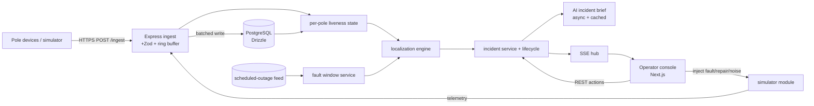

# ARCHITECTURE.md

Technical description of the GridWatch AI system as built. This document
matches the code in the repo. If a reviewer cross-references and finds a
mismatch, treat that as a bug — this file is kept current.

> Companion docs: `approach.md` (why it's shaped this way), `DECISIONS.md`
> (running log), `README.md` (front door), `DEPLOYMENT.md` (how to run it).

---

## 1. System diagram



One PostgreSQL instance, one Express API, one Next.js console (Next `standalone`
mode, served from the API host or a sidecar). All three are in one docker-compose.

## Plumbing notes

- **Clock skew (±90 s):** within a device, `seq` is the ordering and de-dup key.
  Across devices, state is applied by arrival, but the *state builder* tags each
  event with an arrival time and a skew-corrected event time; boundary decisions
  use a shared evaluation window, not raw device clocks.
- **Out-of-order / duplicates:** unique key `(device_id, seq)`. Events with a
  `seq` below the last observed for a device are dropped. A device may backtrack
  after a `boot` (seq resets to 0); a boot resets the high-water mark.
- **Stale retries (up to 6 h):** a `power_lost` older than the liveness window
  is not allowed to create a *new* incident on its own, but it is recorded.

---

## 2. Ingestion

**Endpoint:** `POST /ingest` — accepts a single event or a batch (array), JSON.
Zod-validated against the contract in `packages/api-contract`. Unknown
`device_id`/`pole_id` are logged and counted (drift metric), not rejected.

**Handling bursts and sustained load (D9):**
- A bounded in-memory ring buffer decouples HTTP accepts from writes.
- A batch writer drains it (e.g., 500 rows or 100 ms, whichever first) into
  Drizzle batch insert; on writer failure, the buffer backs up, then the
  endpoint returns 503 and clients retry (at-least-once, so this is safe).
- Throughput and buffer depth are exposed as metrics. We *measure* 39 msg/s
  steady and the 5,000/10 s burst with a load script and record the numbers in
  this section, rather than claiming them.

**Why not a queue service:** at this scale a single-process buffer is
measurably sufficient and keeps G2/G4 to one compose. The boundary where we'd
introduce a broker (multi-subdivision / multi-instance) is called out in §8.

---

## 3. Storage and internal model

PostgreSQL, managed by Drizzle. Schema (in `packages/db`), tables:

| Table | Purpose | Notable columns |
|-------|---------|-----------------|
| `feeders` | 11 kV feeder | `id`, `substation_id` |
| `transformers` | DT | `id`, `feeder_id`, `lat`, `lon`, `capacity_kva`, `households_served` |
| `poles` | pole registry | `id`, `lat`, `lon`, `feeder_id`, `dt_id`, `seq_on_line`, `parent_pole_id`, `ward`, `pincode`, `device_id` |
| `edges` | resolved topology | `dt_id`, `from_pole`, `to_pole`, `source` (`recorded`/`inferred`/`learned`), `confidence` |
| `telemetry_events` | raw, append-only | `device_id`, `pole_id`, `event`, `energized`, `seq`, `fw`, `recv_at`, `event_ts`; unique `(device_id, seq)` |
| `pole_state` | materialized liveness | `pole_id`, `energized`, `last_power_lost_at`, `last_heartbeat_at`, `since` |
| `incidents` | grouped faults | `id`, `type` (span/dt/feeder), `confidence`, `scope` (span/dt/feeder), `dt_id`, `feeder_id`, `from_pole`, `to_pole`, `coords`, `pincode`, `affected_pole_ids`, `status`, debounce fields |
| `tickets` | incident lifecycle | `incident_id`, `status`, `resolved_by`, `verified_at`, timestamps |
| `scheduled_outages` | from the feed | `scope`, `target_id`, `start`, `end`, `reason` |
| `edges_history` | learned-topology counters | `pole_a`, `pole_b`, `co_dark_count` |

**Topology representation (D1):** a radial forest. `edges` store the resolved
parent→child relationship per DT; each DT is a sub-tree rooted at the DT's
first pole. We store `edges` rather than re-deriving so the three topology
sources and their confidence are explicit and re-computable, and so co-use
learning has a home.

---

## 4. Localization algorithm

This is the part worth the most. It is deterministic, tested, and explainable —
**no LLM touches it** (D12).

### 4.1 Build the per-pole dark/live state

The state builder turns raw telemetry into a `pole_state` snapshot each tick:

- A pole is **dark** if its last known signal was `power_lost` (energized=false)
  OR it stopped heartbeating for > `2 × interval + grace` (~16–20 min).
- A pole is **live** otherwise.
- Poles with no device (`device_id` empty) are **unknown**, not live.

### 4.2 Find boundaries (cut edges)

Within each DT sub-tree, mark poles dark/live. A single downstream fault makes
the dark set exactly the downward-closed subtree below the failed edge. Find
candidate cut edges = edges whose live side stays entirely live and whose dark
side is entirely dark:

- Walk the sub-tree. Any edge whose upstream node is live and all downstream
  nodes are dark is a boundary candidate.
- If the whole DT is dark with a live feeder above it → **DT fault**.
- If every DT on a feeder is dark with the feeder's own boundary → **feeder fault**.

### 4.3 Grouping (D4)

The dark set, projected onto the sub-tree, is partitioned into **connected
components**. Each component is one zone with one cut edge. One component ⇒ one
incident. Two separate faults on the same line produce two disjoint components
⇒ two tickets. A single fault never pops one ticket per pole because every dark
pole in a component maps to the same cut edge. A monotonic check: the number of
tickets equals the number of boundary components, never the number of dark poles.

**Blind-pole contraction.** Grouping is run over each pole's **nearest
device-bearing ancestor**, not the raw tree. A non-instrumented pole (empty
`device_id`) carries no liveness, so a single dark region that crosses one would
otherwise be split into two components (the blind pole reads as "live"). By
contracting blind poles, one physical dark region stays one incident across a
coverage gap; the physical affected set (households, pincode, coordinates) is
still expanded through the blind poles. This is the ~9% no-device gap made
honest: it costs confidence (via coverage), not correctness.

### 4.4 Confidence (D5)

`confidence = coverage × cleanliness × timing × topology_source`, each in
[0,1], multiplied:

- **coverage:** share of poles in the affected span that have devices (a dark
  zone whose edge poles are mostly un-wired is murkier).
- **cleanliness:** how cleanly the dark/live boundary agrees across neighbors
  (isolated dark poles with live children lower it toward "dead sensor").
- **timing:** how tightly the dark signals clustered in time (burst ⇒ high;
  stragglers ⇒ lower).
- **topology_source:** `recorded`=1.0, `inferred`=0.6–0.8 (by inference
  stability), `learned`=0.8+ above a co-occurrence threshold, dt-fallback=0.4.

### 4.5 The 60% missing topology (D3 — the central answer)

`edges` are constructed in priority order:
1. **Recorded** order: use `seq_on_line` directly (40% of DTs).
2. **Geometric inference** (60%): per DT, sort poles by angle from the DT,
   detect the trunk direction, assign each pole its nearest candidate parent
   (closer to the DT, within max span, anti-fork rule), then **stability-check**
   the edge set by perturbing parent candidates and confirming the boundary is
   unchanged.
3. **Cross-check with co-use history** (learned edges): poles repeatedly dark
   together are promoted to edges.

When, after this, the boundary is ambiguous (inference unstable, low cleanup),
we **fall back to DT-level localization** (`scope=dt`): the answer is "fault
area = DT D-0112", the driving coordinate is the DT, the PIN is the DT's, and
confidence inherits a low `topology_source`. The UI labels every answer
`span` | `dt-area` | `feeder` so the operator never mistakes a coarse answer
for a precise one.

**Failure modes (documented):** geometric inference mis-assigns parents on
parallel streets and at long branches; the stability check catches many but not
all; co-use learning can be fooled by two faults that merely overlap in time
until repeated. We state the measured inferred-vs-truth error from the synthetic
network in the code/tests.

### 4.6 Complexity

Building states is O(poles). Boundary scan is O(poles) per DT (one tree walk).
Grouping is a union–find over dark poles. Total ≈ O(poles log poles) for a full
recompute; with incremental updates it's O(changed region). Fine at 38,400-ish
poles; the reduced network is a few thousand.

---

## 5. Noise handling (don't cry wolf)

- **Scheduled outages (D7):** incidents whose affected poles fall entirely
  inside a `scheduled_outages` window for that feeder/DT are suppressed (no
  ticket) or tagged `expected`. Because the feed is unreliable (late start,
  overrun, cancelled), an outage that *overruns* its `end` is surfaced as
  "expected window elapsed" rather than silently auto-suppressed forever.
- **Dead sensor**: single isolated dark pole with live children is
  **physically impossible as a line fault** ⇒ no ticket; mark the device
  suspect. Same for a pole that silently stops heartbeating while its children
  stay live.
- **~4% idle offline fleet**: a lone silent pole with live neighbors is
  sensor/connectivity, not an outage. Only a *region* gone dark becomes a ticket.
- **Debounce:** a fault must be confirmed by a short debounce window (fast-path:
  a `power_lost` burst plus a confirm; slow-path: the full heartbeat-silence
  confirmation) before a ticket opens, to avoid firing on a transient.
- **Duplicates/late/out-of-order:** deduped at ingest (`(device_id, seq)`).
  Stale `power_lost` cannot open a *new* incident.

---

## 6. Ticket workflow & verification (D8)

Lifecycle: `detected → acknowledged → crew_assigned → resolved → verified → closed`,
plus `disputed` where telemetry contradicts the operator.

- **Resolution is telemetry-only.** Auto-verify: when ≥ ~90% (threshold, config)
  of affected poles report live (`power_restored` / `boot` / heartbeats resume)
  and stay live for a short confirmation window, the ticket auto-advances to
  `verified → closed` — no click involved.
- **Pushback:** if an operator marks `resolved` but the affected poles are still
  dark (below threshold, past the confirmation window), the ticket moves to
  `disputed`, the UI shows the conflict ("marked fixed, 34 of 40 poles still
  dark"), and it is not closed until telemetry agrees.

---

## 7. API surface

All JSON + Zod. Shared types in `packages/api-contract`. Methods/paths:

| Method | Path | Purpose |
|--------|------|---------|
| POST | `/ingest` | Telemetry (single or batch). |
| GET | `/health` | Liveness. |
| GET | `/api/network/feeders` `/api/network/transformers` `/api/network/poles` | Registry, for map + list. |
| GET | `/api/poles/state` | Current live/dark per pole. |
| GET | `/api/incidents` | Incidents (severity-ranked). |
| GET | `/api/incidents/:id` | Detail incl. timeline + affected poles. |
| POST | `/api/incidents/:id/acknowledge` | Operator ACKs. |
| POST | `/api/incidents/:id/assign` | Crew assignment note. |
| POST | `/api/incidents/:id/resolve` | Mark resolved (post-telemetry-check). |
| GET | `/api/tickets` `/api/tickets/:id` | Ticket views. |
| GET | `/api/scheduled-outages` | The mocked planned-outage feed. |
| POST | `/api/simulator/fault` `/api/simulator/repair` `/api/simulator/noise` | Drive the simulator from the UI (G5). |
| GET | `/api/system/stats` | Ingest rates, open counts, buffer depth. |
| GET | `/events` (SSE) | Live updates to the console (D10). |

Realtime uses **SSE**. WebSockets/Socket.IO was rejected: proxy upgrade failures
on free tiers are a known deploy trap, and the console's < 2 s target is
satisfied by SSE + a polling fallback.

---

## 8. Operator console (15% of score)

First screen = a **severity-ranked incident feed** dominating the view, plus a
map and a slim KPI strip. Information hierarchy (for a non-engineer at 2 a.m.):

- **Dominates:** open incidents, each card = type, span/area label, driving
  coordinate + PIN code, households/poles affected, confidence bar, and the
  single next best action (`ACK` / `Assign` / `Resolve`).
- **Supports:** live map of live/dark poles with the fault marker; a detail
  timeline showing detected → boundaries → verified evidence.
- **Explicitly NOT on screen:** crew routing, historical analytics, admin/auth
  (stub operator), config.

**Left out and why:** anything that slows the "what broke and where" read.
We expect the *severity ranking* (households × confidence × urgency) to be the
decision most likely debated/wrong, and it is documented as such.

---

## 9. The AI feature (D12)

**Location:** a plain-language **incident brief** plus **recommended field
checks** appended to each ticket — generated from the structured incident
context (type, affected poles, boundary, confidence, PIN, households). 

```text
input : {type:"span", from:"P-024431", to:"P-024432", coords, pincode,
         confidence:0.81, affected:47, fw_mix:{1.2:3,1.4:44}, reason:"boundary", ...}
output: brief text << 200 words + a checklist.
```

- **Why here and not localization:** localization is arithmetic — a graph
  traversal is deterministic, instant, free, and explainable; an LLM is none of
  those and would cost score (the brief warns it). The narrative is the
  genuinely variable, prose-shaped part worth a model: it compresses evidence,
  frames ambiguity honestly, and suggests what to check next — saving reading
  time at 2 a.m. It is add-on value on top of a correct, already-there ticket.
- **Cost:** ~1 short call per new incident, cached per incident id, async so the
  ticket opens instantly and the brief fills in. Cost is trivially small at
  12–18 incidents/day.
- **When unavailable/wrong:** the ticket and all data stand alone; a static
  template renders instead. The brief is labeled `ai-draft`. No downstream
  action depends on it, so a bad/missing model degrades gracefully.

---

## 10. Scale to 30 subdivisions

- **Extends:** tenant = `subdivision_id` column on core tables (or per-cluster
  DB); the entire localization runs per subdivision and is embarrassingly
  parallel. Ingest is horizontally scalable behind a broker.
- **Does not extend (as built):** the in-memory ring buffer and the SSE hub are
  single-node. Past one subdivision, we'd add a queue (Kafka/NATS) for ingest
  and a pub/sub or multi-replica SSE shard. The alerting + topology constructors
  stay identical per sub-division. This boundary is chosen, not accidental.

---

## 11. Performance (measured, not claimed)

| Metric | Target | Measured |
|--------|--------|----------|
| Fault → localized ticket visible | < 120 s p95 | 15.5 s p95 / 15.5 s max (3 clean iterations) |
| Ingest sustained | ≥ 500 msg/s | 991 msg/s achieved, 0 dropped, buffer high-water 500 |
| Ingest burst | 5,000/10 s, no loss | 5000 accepted / 5000 applied / 0 dropped, 1.26 s round-trip |
| Console incident list | < 2 s | 15 ms p50 / 20 ms p95 / 135 ms max (30 iters) |
| Restoration → auto-verified | < 120 s | 15.3 s p95 / 15.3 s max (3 clean iterations) |

All numbers recorded with the in-repo load harness on a freshly seeded network
(1801 poles, 24 DTs, 8 feeders, 1660 devices):

```
pnpm --filter @gridwatch/api load burst --msgs 5000
pnpm --filter @gridwatch/api load sustained --seconds 30 --rate 1000
pnpm --filter @gridwatch/api load console --iters 30
pnpm --filter @gridwatch/api load loop --iters 3
```

Sustained was also probed at a 5000 msg/s target: the server absorbed every
message with zero loss (client single-thread pacing is the bottleneck, not the
ingest). Serialized `power_lost` bursts mean the fast path is dominated by the
detection debounce window rather than ingest throughput.

Slow path (fw 1.2 / lost `power_lost`) detection latency is bounded by the
heartbeat-silence window (~16–20 min) — a documented trade-off of the data
contract, present in DECISIONS.md, not hidden.